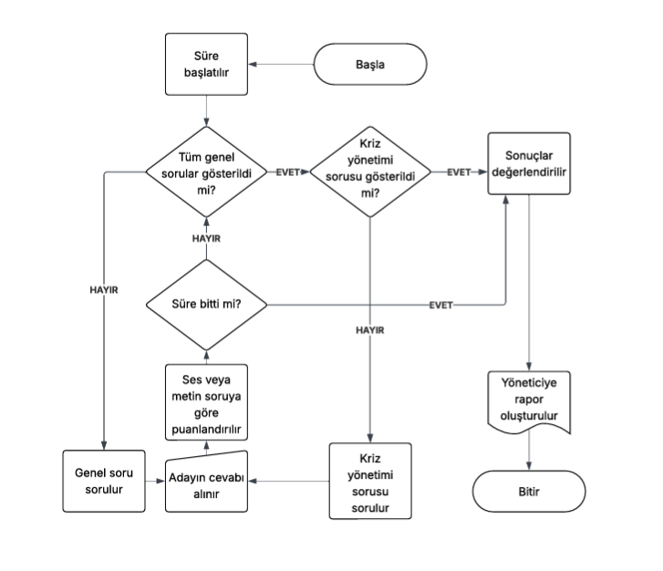
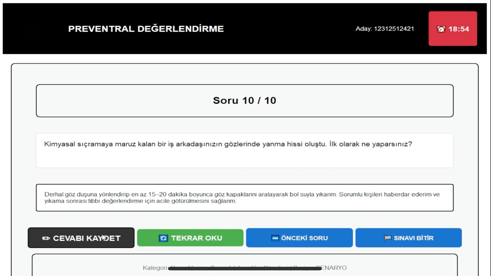
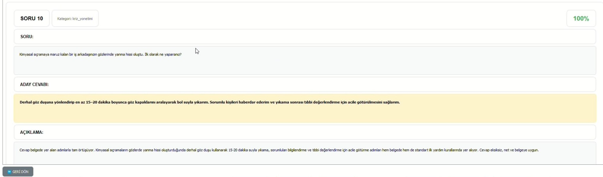
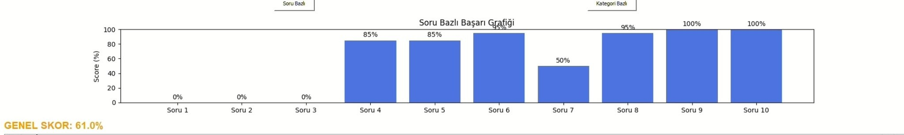

# 🦺 PREVENTRAL — AI-Powered OHS Competency Evaluation System

**TEKNOFEST 2025 Turkish Natural Language Processing Competition — 2nd Place, Free Category 🥈**

**NLP • LLM • RAG • Speech-to-Text • Semantic Search • Fine-Tuning**

---

## 📌 About

**PREVENTRAL** is an AI-powered **Occupational Health & Safety (OHS) competency evaluation system** developed to measure not only whether employees completed their training, but whether they actually acquired the required knowledge, risk awareness, and crisis-management skills.

> **“Was the training completed?” → “Was it actually learned?”**

Candidates can respond through **voice or text**. Voice responses are converted to text using **Whisper**, relevant OHS knowledge is retrieved through **RAG + FAISS**, results are reranked using a **Cross-Encoder**, and **Qwen3-8B** evaluates the response and generates competency-based feedback.

The system combines **semantic retrieval, LLM evaluation and weighted scoring** to provide a contextual and competency-oriented assessment.

---

# 🧠 Core Capabilities

* 🎙️ Voice & text-based assessment
* 🦺 Technical knowledge and OHS regulation evaluation
* ⚠️ Risk recognition and crisis scenarios
* 🔎 RAG-based domain knowledge retrieval
* 🧩 Semantic similarity with FAISS
* 🔄 Cross-Encoder reranking
* 🤖 Qwen3-8B LLM evaluation
* 📊 Competency-based scoring
* 📝 Automated feedback and reporting

---

# 🏗️ System Architecture

PREVENTRAL follows a multi-stage AI evaluation pipeline covering **response collection, speech processing, retrieval, contextual analysis, scoring and reporting**.

### System Architecture

[📄 View System Architecture](assets/architecture/preventral_system_architecture.pdf)

### Assessment Workflow



```text
Candidate
   │
   ├── Text Response
   │
   └── Voice Response
          │
          ▼
   Whisper STT
          │
          ▼
   Text Preprocessing
          │
          ▼
   multilingual-e5-large
          │
          ▼
   FAISS Similarity Search
          │
          ▼
   Cross-Encoder Reranking
          │
          ▼
   Relevant OHS Context
          │
          ▼
   Qwen3-8B
          │
          ├── Contextual Analysis
          ├── Response Evaluation
          └── Feedback Generation
          │
          ▼
   Weighted Scoring
          │
          ▼
   Competency Report
```

---

# 🔎 RAG & Semantic Retrieval

PREVENTRAL uses **Retrieval-Augmented Generation (RAG)** to ground the evaluation process in sector-specific OHS knowledge.

```text
OHS Documents
      ↓
Document Chunking
      ↓
Embedding Generation
      ↓
FAISS Retrieval
      ↓
Cross-Encoder Reranking
      ↓
Relevant Context
      ↓
Qwen3-8B Evaluation
```

### Embedding Model

**`intfloat/multilingual-e5-large`**

The embedding model enables semantic matching between candidate responses and relevant OHS information, even when different wording is used.

### Scoring

The final score combines multiple evaluation signals:

```text
Final Score
    =
Semantic Similarity
    +
LLM Evaluation
    +
Context Relevance
```

---

# 🤖 Model & Fine-Tuning

## Qwen3-8B

**Qwen3-8B** is used through Ollama for Turkish context understanding and competency evaluation.

A domain-specific dataset was prepared around **Personal Protective Equipment (PPE)** awareness and workplace hazard scenarios.

### Dataset

| Parameter     |     Value |
| ------------- | --------: |
| Total Samples |       300 |
| Training      | 210 (70%) |
| Test          |  90 (30%) |
| Score Range   |     0–100 |

### Data Structure

| Field    | Description                     |
| -------- | ------------------------------- |
| `prompt` | Assessment question             |
| `answer`  | Participant response            |
| `range`  | Response quality / detail score |

### LoRA Configuration

| Parameter      |              Value |
| -------------- | -----------------: |
| LoRA Rank      |                  8 |
| LoRA Alpha     |                 32 |
| LoRA Dropout   |                0.1 |
| Target Modules | `q_proj`, `v_proj` |
| Bias           |             `none` |
| Task Type      |        `CAUSAL_LM` |

### Training Configuration

| Parameter             |               Value |
| --------------------- | ------------------: |
| Max Length            |                 256 |
| Batch Size            |                   8 |
| Gradient Accumulation |                   4 |
| Epochs                |                   3 |
| Optimizer             | `adamw_torch_fused` |
| Learning Rate         |             0.00003 |
| Weight Decay          |                0.01 |
| FP16                  |             Enabled |
| Evaluation            |             `epoch` |
| LR Scheduler          |            `linear` |
| Warmup Ratio          |                0.05 |

---

# 🎙️ Speech Processing

PREVENTRAL supports both **voice and text responses**.

Voice responses follow the same downstream evaluation pipeline:

```text
Voice Response
      ↓
Whisper STT
      ↓
Text Processing
      ↓
RAG Retrieval
      ↓
LLM Evaluation
      ↓
Feedback
```

This allows candidates to interact naturally while maintaining a unified text-based evaluation pipeline.

---

# 🖥️ Product

## Candidate Assessment

The candidate panel provides an interactive assessment experience with:

* Technical knowledge questions
* OHS regulation questions
* Risk and crisis scenarios
* Voice and text responses
* Controlled question progression

### Question Interface



---

## AI Evaluation

After the candidate submits a response, the system evaluates it using retrieved OHS context and **Qwen3-8B**.

The evaluation considers factors such as:

* technical correctness,
* relevance,
* completeness,
* contextual meaning,
* and safety awareness.

### LLM Evaluation



---

## Scoring & Feedback

The evaluation layer produces a competency score and provides feedback based on the candidate's response.

### Scoring Result



---

# 🏢 Sector Adaptability

The architecture can be adapted to different high-risk industries through sector-specific documents, questions and evaluation criteria.

* 🏗️ Construction
* ⚡ Energy
* ⛏️ Mining
* 🏭 Manufacturing
* 🏥 Healthcare
* 🚢 Maritime

---

# 🧪 Results & Findings

* **RAG** grounds candidate-response evaluation in relevant OHS documentation.
* **FAISS + multilingual-e5-large** enables semantic retrieval beyond keyword matching.
* **Cross-Encoder reranking** improves contextual relevance before LLM evaluation.
* **Whisper STT** enables voice-based assessment within the same NLP pipeline.
* Combining **retrieval signals and LLM interpretation** provides a richer competency assessment.

The architecture can be extended with additional sector-specific knowledge bases, datasets and assessment scenarios.

---

# 🛠️ Technology Stack

| Category       | Technologies                               |
| -------------- | ------------------------------------------ |
| Programming    | Python                                     |
| LLM            | Qwen3-8B                                   |
| LLM Runtime    | Ollama                                     |
| Fine-Tuning    | LoRA / PEFT                                |
| Embeddings     | `intfloat/multilingual-e5-large`           |
| Vector Search  | FAISS                                      |
| Reranking      | Cross-Encoder                              |
| Speech-to-Text | Whisper                                    |
| Architecture   | RAG                                        |
| NLP            | Preprocessing, Chunking, Semantic Matching |

---

# 🎥 Demo

A demonstration of the PREVENTRAL assessment workflow is available in:

**[`assets/demo/preventral_demo.mp4`](assets/demo/preventral_demo.mp4)**

---

# 📁 Repository Structure

```text
preventral/
│
├── assets/
│   ├── architecture/
│   │   ├── .gitkeep
│   │   └── preventral_system_architecture.pdf
│   │
│   ├── demo/
│   │   ├── .gitkeep
│   │   └── preventral_demo.mp4
│   │
│   ├── diagrams/
│   │   ├── .gitkeep
│   │   └── assessment_workflow.png
│   │
│   └── screenshots/
│       ├── .gitkeep
│       ├── llm_evaluation.jpeg
│       ├── question_screen.jpeg
│       └── scoring_result.jpeg
│
└── README.md
```

> **Note:** PREVENTRAL is a private project. Source code, proprietary datasets and implementation details are intentionally not publicly available. This repository presents the system architecture, technical approach, workflow and product demonstrations.

